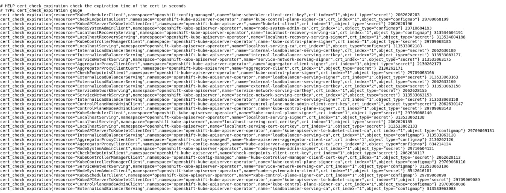

# OCP-CERTS-EXPIRATION-CHECK

This is a NodeJS application designed to check all certificates listed in code/config/resources.json and publish Prometheus metrics with their expiration time.

- It can check secrets and Configmaps from any namespace, useful if you want to control when are going to rollout each Openshift component, or getting warned if the certificate of an application is out of date.

- If the object name ends with "-*" or "*", it will check the last certificate with name matched.

        Example config defined: 'secret-example-*'
        Will check just 'secret-example-3' from items 'secret-example, secret-example-1, secret-example-2, secret-example-3' in the same namespace.

- Also if the file inside the secret/configmap contains multiple certificates, all of them are going to be checked, each certificate will have an index assigned in the metrics exposed with label 'crt_index'.




## Install

To install it you need to be clusteradmin, create the namespace and deploy the manifests:

```
oc new-project cert-check
oc apply -f manifests/
```

## Configuration

Set the desired certificate list to check in the code/config/resources.json file keeping the JSON structure of the examples already included. In the future will be moved to a Configmap, although the desired thing would be to export it to a CR in yaml format.

## TODO tasks

- [ ] Implement resources.json in a Configmap
- [ ] I want to implement for each certificate a configuration value "config.validity" to compare with its current TTL and obtain tighter warnings.